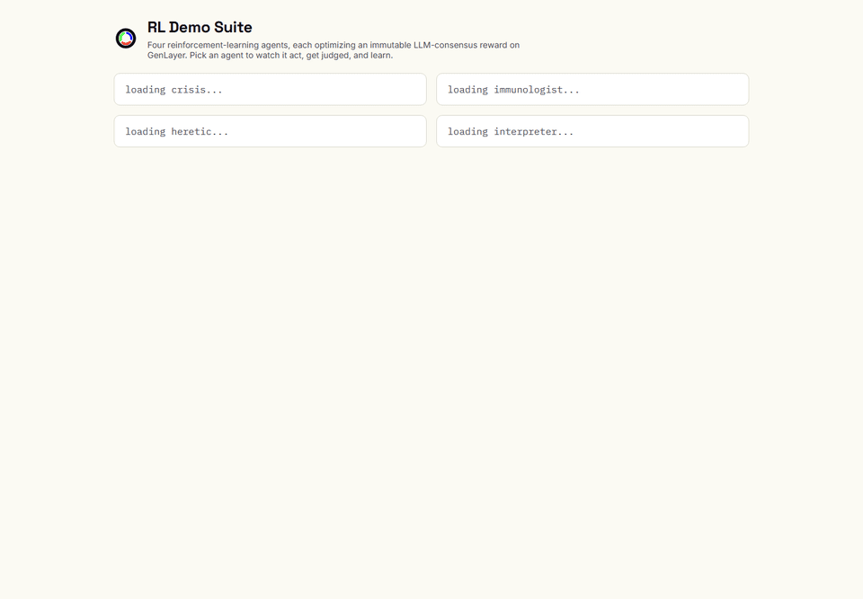

# GenLayer RL Demo Suite

One hosted dashboard for watching four reinforcement-learning agents learn
human-like judgment from an on-chain LLM committee on GenLayer.

**Live: https://luch91.github.io/genlayer-rl-demo-suite/**



*Screen recording captured from the live personal dashboard. It demonstrates the overview, Replay instrument panel, learning curve, on-chain receipt, and Live contract read.*

Part of [GenLayer RL Agent Autonomy](https://github.com/luch91/genlayer-RL-agent-autonomy).

The consolidated `genlayer-rl-agent-autonomy` repository publishes one
manifest per domain under `manifests/`, describing its contract, reward
function, mock learning curve, and any recorded runs. This suite is a pure
reader of those manifests. It never imports agent source. Run
`AUTONOMY_MANIFESTS=../genlayer-rl-agent-autonomy/manifests npm run sync` when
developing locally, then commit the refreshed `public/data/*.json` files.

## Domains

| Tab | Source | The agent learns to |
|---|---|---|
| Crisis Negotiator | [`contracts/crisis_negotiator.py`](https://github.com/luch91-org/genlayer-rl-agent-autonomy/blob/main/contracts/crisis_negotiator.py) | Dispatch drones, ambulances, and supplies without wasting capacity |
| Protocol Immunologist | [`contracts/protocol_immunologist.py`](https://github.com/luch91-org/genlayer-rl-agent-autonomy/blob/main/contracts/protocol_immunologist.py) | Pause, rotate signers, and hedge only when a threat is real |
| Scientific Heretic | [`contracts/scientific_heretic.py`](https://github.com/luch91-org/genlayer-rl-agent-autonomy/blob/main/contracts/scientific_heretic.py) | Propose novel, falsifiable, plausible hypotheses |
| Diplomatic Interpreter | [`contracts/diplomatic_interpreter.py`](https://github.com/luch91-org/genlayer-rl-agent-autonomy/blob/main/contracts/diplomatic_interpreter.py) | Draft compromise text that lowers polarization |

## Architecture

The suite is manifest-driven. A zod schema (`lib/manifest.ts`) validates every
manifest at load time; the dashboard renders generically from the validated
shape. The only domain-specific code is a small state renderer per domain,
selected by `domain.id`, with a generic key-value fallback.

Under a comparative equivalence principle the validators vote
agree/disagree/idle/timeout on the leader's single numeric score. They do not
each emit an independent number. The schema and UI reflect that reality and do
not invent per-validator scores.

## Screens

- `/` is the overview: a card per agent with its live status, headline score, and
  a learning-curve sparkline. Each card opens that agent's screen.
- `/{domain}/episode/` is the instrument panel: world state and the on-chain
  judge side by side, a step timeline you can play or scrub, the policy
  inspector, and an inspect drawer for the raw per-step detail.
- `/{domain}/learning/`, `/{domain}/verification/`, and `/{domain}/live/` are the
  learning curve, the full on-chain receipt, and a live contract read. They are
  reached from the in-screen view nav, not a second header row.

A single global Replay / Live toggle in the header switches the world-state
source everywhere: Replay reads the recorded run, Live reads the deployed
contract. GenLayer studionet has no public explorer, so addresses and
transaction hashes are shown in full to copy rather than linked out.

## Tech stack

- Next.js 15 (App Router) with static export
- TypeScript
- `genlayer-js` for live on-chain reads
- `zod` for manifest validation
- `vitest` for tests

## Development

```
npm install
npm run dev        # local dashboard
npm run typecheck  # tsc --noEmit
npm run test       # vitest
npm run build      # static export to out/
```

## Data honesty

Fixtures in `public/data` are seeded from real runs: real contract addresses,
real learning curves, and real consensus receipts captured from live studionet
transactions. Anything that could not be captured from a real run is flagged as
illustrative so the UI can surface it rather than hide it.

## License

MIT
